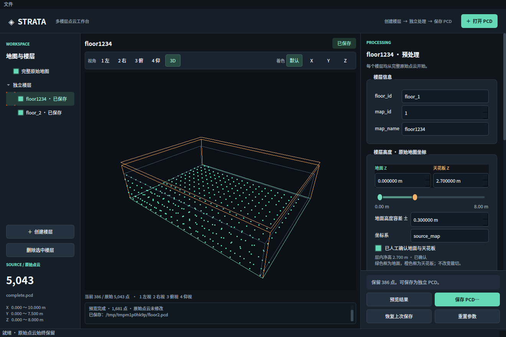

# Strata · 多楼层点云工作台

现在使用统一的楼层处理流程：**创建楼层 → 在同一预处理面板裁切、降采样、去噪 → 预览 → 保存独立 PCD**。每个楼层始终从完整原始 PCD 重新计算，不继承其他楼层或“完整地图”对象的预处理结果。



上图由真实 Qt 控件与同一时刻的 Open3D 帧缓冲组合，用于界面检查；Qt 普通截图不包含原生 Open3D 子窗口。

## 运行

```bash
cd /home/zl0344/dev_ws/multi_floor_map_tool
.venv/bin/python main.py
# 也可以直接打开文件
.venv/bin/python main.py /path/to/complete.pcd
```

当前工作区依赖已经安装。新机器需要 Python 3.10+、Linux X11 / XWayland、OpenGL 驱动与 `xwininfo`（Ubuntu `x11-utils`）。

```bash
python3 -m venv .venv
.venv/bin/pip install -r requirements.txt
.venv/bin/python scripts/create_demo.py /tmp/strata_demo.pcd
.venv/bin/python main.py /tmp/strata_demo.pcd
```

当前机器缺失的 `libxcb-cursor0` 已从 Ubuntu 软件源下载到项目 `.runtime/`，启动时本地加载，未修改系统包。新机器可使用系统提供的该库；原生 Wayland / Windows / macOS 尚未适配。

## 新工作流

1. 打开包含所有楼层的完整 PCD。
2. 点击左侧「创建楼层」，生成 floor_1、唯一 map_id 和 map_name。
3. 选中 floor_1，直接在右侧**同一个预处理面板**填写身份信息并设置 XYZ 裁切、Voxel 和去噪参数。
4. 「预览结果」从完整原始点云重新计算。修改参数后，旧预览失效，需再次预览。
5. 在「楼层高度」用双滑块设置原始地图坐标系中的地面 Z 和天花板 Z，也可直接输入数值；填写容差和坐标系，勾选人工确认。点击「保存 PCD…」写出独立 PCD、同名 `.rules.yaml`，并自动更新同目录 `floors.yaml`。
6. 创建 floor_2 后，所有参数默认关闭，重新显示完整原始地图，再独立切分和保存。

**切换对象保留各自草稿。** 每层裁切、降采样、去噪参数、预览和上次保存结果相互独立。左侧「完整原始地图」也可以预处理并另存副本，但不会成为任何楼层的数据源。

- 「恢复上次保存」：恢复当前对象最近保存的配置和点云；尚未保存过则恢复初始参数。
- 「重置参数」：仅把当前对象恢复为无处理参数，显示完整原始点云。不会覆盖已导出的文件，也不会影响其他楼层。
- 删除楼层仅移除工作区对象，磁盘上的 PCD 和参数文件保留。
- 楼层身份字段分别唯一；非法参数、过期预览及空结果不能保存。
- 保存时不允许覆盖原始 PCD（包括指向原文件的链接）；其他已存在导出需明确确认覆盖，也不能复用当前工作区另一楼层的保存路径。

旧的「预处理 / 楼层切分」两个页签及 Apply 步骤已移除。旧模块文档是历史记录，当前行为以本 README 为准。

## 顶部工具栏

工具栏收为一行：左侧视角，右侧着色；按钮显示当前选择，悬停有方向说明。

| 视图区按键 | 功能 |
|---|---|
| 1 | 左视：从 −X 向 +X 看，Z 向上 |
| 2 | 右视：从 +X 向 −X 看，Z 向上 |
| 3 | 俯视：从 +Z 向 −Z 看，Y 向上 |
| 4 | 仰视：从 −Z 向 +Z 看，Y 向上 |

四个方向采用正交投影，「3D」恢复三维透视并居中当前几何。鼠标左键旋转、Ctrl+左键平移、滚轮缩放保留。

着色改用「默认 / X / Y / Z」按钮。数字键不再着色；在名称或数值输入框中，数字键仅用于输入。默认模式使用楼层颜色；完整地图使用高度渐变。颜色只用于显示，不写回原始或导出的点云颜色。

## 离群点过滤

固定处理顺序：**XYZ 裁切 → Voxel 降采样 → 统计过滤 → 半径过滤**。每一步均可独立启停，后台处理；预览和保存操作固定在右侧面板底部。

- **统计过滤 SOR**：设置邻居数和标准差系数。默认 20 / 2.0；系数越小过滤越严格。处理点数不足邻居数时给出错误提示，不静默跳过滤波。
- **半径过滤 Radius**：设置邻域半径和最少邻居数。默认 0.2 m / 3；适合移除孤立点。降采样后点更稀疏，需要相应调整半径与邻居数。
- 可以分别使用，也可以组合使用。参数是否适合当前地图需通过预览检查，默认均关闭。

接口依据 [Open3D 离群点过滤文档](https://open3d.org/docs/release/tutorial/geometry/pointcloud_outlier_removal.html)。

## 数据与文件职责

| 文件 | 职责 |
|---|---|
| `core/edit_session.py` | 原始源、每对象草稿、预览、上次保存结果与保存路径 |
| `models/floor.py` / `core/floor_manager.py` | 楼层完整处理配置、唯一性和编号 |
| `core/pointcloud_processor.py` | 裁切、Voxel、统计与半径去噪；无 GUI 依赖 |
| `core/export_manager.py` | PCD/参数导出、源文件保护、临时文件与失败回滚 |
| `application/workspace_controller.py` | 同一面板的对象切换、预览、保存协调 |
| `application/tasks.py` | 读取、处理与导出后台任务 |
| `gui/preprocessing_panel.py` | 共用参数编辑器与固定底部操作区 |
| `gui/main_window.py` / `gui/theme.py` | 单窗口布局、紧凑工具栏与样式 |
| `gui/pointcloud_view.py` | 嵌入式 Open3D、数字键视角和按钮着色 |

PCD、参数文件和楼层索引先写入临时目录，再替换目标；普通写入异常会回滚已替换文件。三份文件的替换不是针对断电的跨文件原子事务。

`.rules.yaml` 包含原始 PCD 路径、楼层身份、地面与天花板高度、坐标系、所有预处理参数与导出点数。`floors.yaml` 汇总同一目录已导出楼层的高度与文件索引。当前还没有项目级 Save / Load 或参数文件导入界面；未保存的草稿只驻留内存。退出/切换原始文件会提示丢弃未保存编辑。

Open3D legacy 不保证保留 intensity、ring、time 等自定义 PCD 字段，源 PCD 始终保留作为完整原始数据。超大点云的显示副本构建及 GPU 上传仍可能短暂卡顿，尚未做性能验收。

多 Include / Exclude ROI、项目级保存与恢复、PGM/YAML 栅格地图生成仍待实现。楼层 PCD 导出已提前完成。

## 验证

```bash
.venv/bin/python -m unittest discover -s tests -v
.venv/bin/python scripts/smoke_workspace.py
```

真实桌面测试覆盖原生窗口父子关系、真实 1–4 X11 键事件、输入框数字输入、着色按钮、楼层独立性、双重去噪、PCD/参数回读、跨对象草稿、重置和空结果保护。旧 `smoke_gui.py`、`smoke_floors.py` 入口均转到新的统一流程测试，无需重复执行。

本轮没有修改其他工程。验证详情见 [统一流程记录](docs/unified_workspace_validation.md)。

## 楼层高度保存

地面基准 Z 与裁切 Z 范围独立；不从点云最小值自动推断，地面可以在裁切范围之外。高度未确认仍可预览，但不能保存楼层。完整地图另存不要求楼层高度。只改高度、坐标系或身份可沿用当前有效点云预览，不必再次运行滤波。

请将同一建筑的楼层导出到同一目录，以便自动汇总 `floors.yaml`；不同目录各自维护索引。源地图或坐标系不一致、重复标识、无效索引会拒绝合并。索引反映磁盘导出：删除工作区楼层不删除导出及索引记录；同一楼层重新保存会更新对应条目。旧导出需重新保存才能补充高度。

`source_map` 是默认坐标系名称，请按原始地图实际坐标系填写；修改名称不会变换坐标。单位为米，地面参考带针对地面高度，不是机器人机身或雷达 Z。机器人端需要在同一坐标系中读取这些信息并实现判层逻辑，工具不会自动接入定位系统。

[字段示例与验证记录](docs/floor_height.md)。工程级保存与恢复仍未实现。

### 地面—天花板双滑块

左侧绿色端点是地面，右侧橙色端点是天花板，中间为层内空间。拖动与两个数值输入框双向同步；方向键以 0.01 m 微调，Shift + 方向键以 0.1 m 调整，空格切换活动端点。端点不可交叉；手工输入天花板不高于地面时显示错误。

源点云 Z 范围只作为滑块初始刻度和未确认候选值，不代表已经识别出楼层。数值可输入刻度外的高度，滑块会扩展显示范围。未确认的候选范围也会保留在各自楼层草稿中。

3D 中绿色水平框表示地面，橙色水平框表示天花板。调整它们只修改楼层元数据，不改变裁切参数、已预览的点云或相机。保存前需确认地面与天花板，文件新增 `ceiling_z`、`height_range` 和 `clear_height`。

旧版仅有地面信息的索引可合并，缺失的天花板标记为 null，`height_range_complete: false`，不会自动假设层高。重新确认并保存该楼层后补齐。当前 floors.yaml 为版本 2，rules.yaml 为版本 3。
